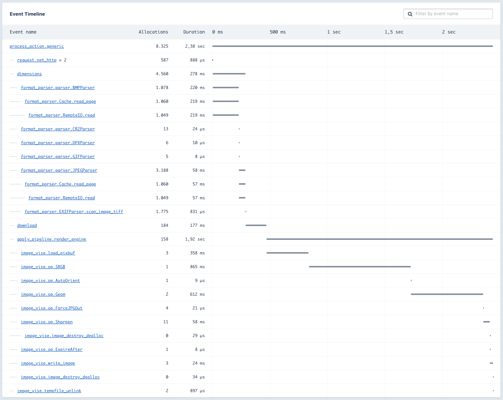

# Measurometer

Minimum viable API for instrumentation _in libraries._ A lightweight "hub" module that
will source simple instrumentation measurements/block contexts to different destinations. To illustrate the usefulness,
imagine you are using a library called `promulgator` in your code, as well as a library called `profligator`

You start measuring how long tasks in your application take, and you notice that an action suddenly takes 30 seconds.
You for a fact know that this action consists of the following code:

```
heavy_model = ModelTree.find(user_id)
prpfligation_outcome = Profilgator.profligate(heavy_model)
Promulgator.promulgate(profligation_outcome)
```

You can see how long `ModelTree.find` takes, because your metrics and error tracing solution latches onto the ActiveSupport
instrumentation hooks and records how long things take. But the Promulgator and the Profligator... who knows
what they do and for how long? Writing of benchmark scripts ensues.

Imagine, on the other hand, that you had the `Meaasurometer` supported in both the Promulgator and the Profligator.
Then you could say, for example, if you use [Appsignal](https://appsignal.com)

```
Measurometer.drivers << Appsignal
```

and metrics from both the `promulgator` gem and the `profligator` gem calls would be sourced to Appsignal automatically.
The good part of it is that neither the `promulgator` or the `profligator` would have to depend on something
heavy (or Rails version dependent!) as `ActiveSupport::Notifications`

## Visualising the benefit

This is an action from one of our applications, where we parse the image format and then perform image processing.
Both tasks (format detection and image transformations) are handled by separate libraries - `format_parser` and
`image_vise` respectively. Even though the graph comes from Appsignal, neither of the libraries has knowledge
of Appsignal's existence in the system.



## Usage with statsd-ruby

For [statsd-ruby](https://github.com/reinh/statsd) we provide a builtin adapter. Pass it your client object:

```
$statsd = Statsd.new 'localhost', 8125
Measurometer.drivers << Measurometer::StatsdDriver.new($statsd)
```

## Installation for libraries

If you want to supply Measurometer metrics, add this line to your **library's** Gemfile:

```ruby
s.add_dependency 'measurometer', '~> 1'
```

That's right, we _promise_ to guarantee version 1 compatibility for as long as possible, for as long
as practical, and if there are to be breaking changes to the API semantic versioning will be followed.

Should it so happen that you do not trust us that API version compatibility will be maintained,
you can **copy** the entire Measurometer into your library, just let the user know that the driver
will have to be installed for your library separately. **Seriously though:** – we do realize
that Measurometer is meant to be a diamond dependency and will therefore commit to maintaining semver.

## Usage in libraries

When executing a semantically meaningful block of code, name the block using your library's name as a prefix,
and run the block wrapped with `Measurometer.instrument()`

```
Measurometer.instrument('profligator.ideate') do
  options_offered_to_client = Thinkfluencer.ideate(the_creative)
  Measurometer.increment_counter('profligator.num_ideations', 1)x
  Measurometer.add_distribution_value('profligator.options_offered_to_client_per_ideation', options_offered_to_client.length)
end
```

Note that it is prudent to make your library provide **either** Measurometer instrumentation **or** ActiveSupport::Notifications,
but **not both** - unless your metrics collection driver/system can deal with that cleanly.

## Usage in applications

If one or more of the libraries you are using are Measurometer-instrumented, all you have to do is
connect a driver. The driver must respond to the same methods as the Measurometer module, and has to
be explicitly added to the set of Measurometer drivers to source instrumentation, like so:

```
Measurometer.drivers << Appsignal
```

Appsignal, since Measurometer's API copies it's instrumentaiton API, can be used as-is,
without any adapters.

## Development

After checking out the repo, run `bin/setup` to install dependencies. Then, run `rake spec` to run the tests. You can also run `bin/console` for an interactive prompt that will allow you to experiment.

To install this gem onto your local machine, run `bundle exec rake install`. To release a new version, update the version number in `version.rb`, and then run `bundle exec rake release`, which will create a git tag for the version, push git commits and tags, and push the `.gem` file to [rubygems.org](https://rubygems.org).

## Contributing

Bug reports and pull requests are welcome on GitHub at https://github.com/WeTransfer/measurometer.

